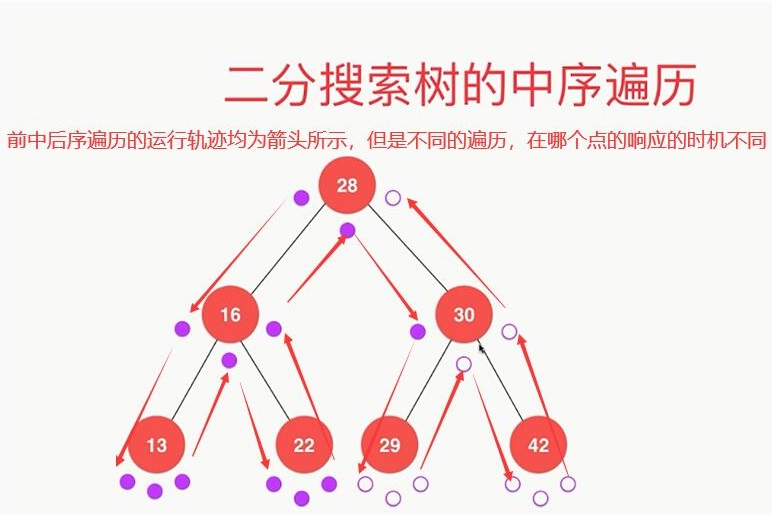

# 数组
- [实现一个int数组并完成增删改查]()
- [实现一个int数组并完成增删改查](/src/main/java/com/equator/datastruct/array/MyIntArray.java)
- [实现一个泛型动态数组并实现增删改查](/src/main/java/com/equator/datastruct/array/MyGenericArray.java)
- 时间复杂度分析以及均摊时间复杂度：并不是每次操作都会触发resize方法，resize的成本可以均摊到其它的操作上面
- 防止时间复杂度的震荡（延迟缩容的时机）：缩容的条件与扩容的条件不对偶即可，如扩容2倍，那么在数组元素为容量的1/4时缩容一半，而不是在数组元素为容量的1/2时缩容

# 链表
- [链表实现](/src/main/java/com/equator/datastruct/linkedlist/MyGenericLinkedList.java)
- [为了统一对节点的操作，创建一个虚拟的头节点](/src/main/java/com/equator/datastruct/linkedlist/MyGenericLinkedListWithDummyHead.java)
- 递归：将问题分为更小的同一问题，一般步骤为
    - 求解最基本的问题
    - 把原问题转化成更小的问题
- 链表具有天然的递归性：一个链表可以看作一个头节点加上一个更短的链表（少一个节点）
- 小技巧：可以给递归函数添加深度参数构造控制台输出理解递归函数

# 栈
- [使用动态数组实现栈](/src/main/java/com/equator/datastruct/stack/MyArrayStack.java)，push()、pop()的均摊时间复杂度均为O(1)
- [使用链表实现栈](/src/main/java/com/equator/datastruct/stack/MyLinkedListStack.java)，将链表的头作为栈顶，push()、pop()的时间复杂度均为O(1)

# 队列
> 循环队列，一般要循环利用指针，可以借助取余运算进行计算对应的下标
- [使用动态数组实现队列，入队O(1)，出队O(n)](/src/main/java/com/equator/datastruct/queue/MyArrayQueue.java)，front==tail时队列空，front+1==tail满队列（浪费一个空间）
- [循环动态队列，通过改变指针指向实现（取余运算）循环队列，入队O(1)，出队O(n)](/src/main/java/com/equator/datastruct/queue/MyCycleQueue.java)
- [循环有界队列](/src/main/java/com/equator/datastruct/queue/MyQuickQueue.java)
- 遍历一个循环队列的方法
  ```
  方法一：
  for(int i = 0;i < size;i++){
      data[(i + front) % data.length]
  }
  方法二：
  for(int i = front;i != tail;i = (i+1) % data.length){
      data[i]
  }
  ```
- [使用链表实现队列，添加尾部指针]/src/main/java/com/equator/datastruct/queue/MyLinkedListQueue.java)


# BST
## 二叉树
- 二叉树和链表一样，都是动态的数据结构
- 二叉树具有唯一的根节点，每个节点最多有两个孩子节点
- 二叉树和链表一样也具有天然的递归结构，而且由于其是非线性结果，递归性比链表更为重要
- 二叉树不一定是满二叉树：一个节点也是二叉树，NULL节点也是二叉树
## 二分搜索树 BST
- BST是二叉树
- BST每个节点的值：大于其左子树所有节点的值，小于其右子树所有节点的值
- 二分搜索树的子树也是二分搜索树
- 二分搜索树储存的元素必须具有可比较性
- BST默认不包含重复元素，如果想要包含重复元素，需要包含重复元素的话，需要修改BST的定义：左子树小于等于根节点或者右子树大于等于根节点（或者给节点添加一个新属性——数目，表示同样的节点有多少个）
- X序遍历是相当于遍历当前节点的相对位置而言的
    - BST的前序遍历是最自然最常用的遍历方式
    - BST的中序遍历方式是升序遍历
    - BST的后续遍历没有规律性，一个重要的应用是为BST释放内存（针对没有自动内存管理的语言）
    - 如何得到一个降序的序列？右子树->当前节点->左子树的顺序遍历即可
- 快速得到树的遍历序列（下图中序遍历，只有当访问到中间那个点的时候才响应）
- 
- 前序遍历的非递归写法：利用栈，压入后续节点时，先压入右孩子再压入左孩子（前中后序遍历均为深度优先遍历）
- 层序遍历为广度优先遍历，BFS一般用于求解最短路径
- 图也有DFS与BFS，但是图需要标记是否已访问过。树不需要，因为树是有方向的
- BST删除最大、最小节点
- BST删除任意节点
    - 只有左孩子（与删除最大节点类似）
    - 只有右孩子（与删除最小节点类似）
    - 删除有左右孩子的节点——Hibbard Deletion：找到待删除节点D的右子树的最小值作为后继S（也可以找左子树的最大值）
    1. 删除D的右子树中的最小节点 S.right = removeMin(D.right)
    2. 连接左子树 S.left = D.left
# 集合与映射

# 优先队列与堆

# 线段树

# 字典树

# 并查集

# AVL

# 红黑树

# 哈希